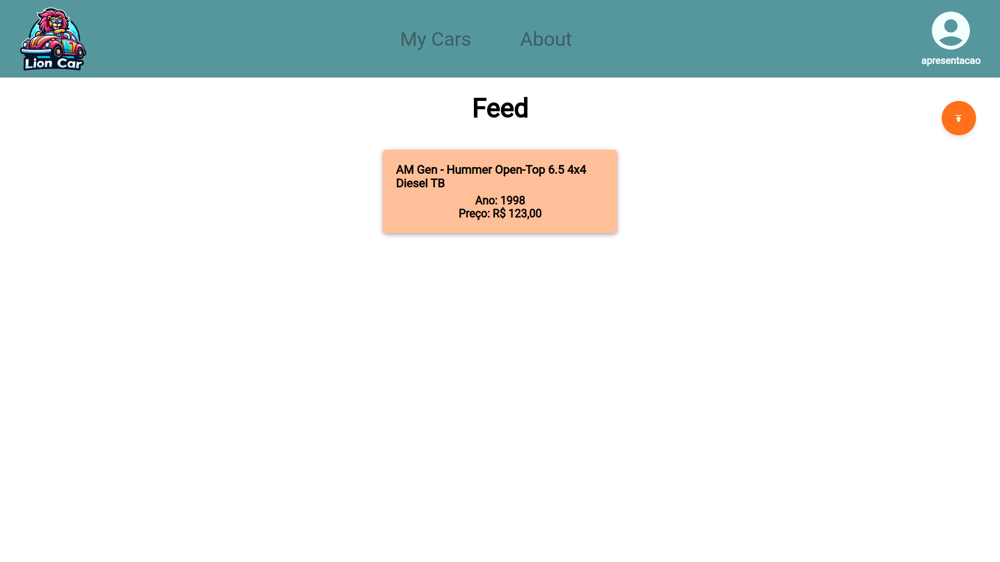

# LionCar
[Link do repositório do projeto](https://github.com/insper-tecnologias-web/projeto-3-leao)

**Autores:** Lucas Lima, Luiz Pini, Felipe Maia e Sérgio Carmelo 


## Descrição do Projeto
[Vídeo de descrição do projeto](https://www.youtube.com/watch?v=sqefaoDILBI)

Este é um projeto desenvolvido em React e Django com o objetivo de colocar em prática conhecimentos sobre tecnologias web. O intuito do site é servir como uma plataforma de compra e venda de veículos.



## Funcionalidades

1. CRUD: criar, ler, editar e remover veículos da plataforma.

2. Puxar de uma [API externa](https://deividfortuna.github.io/fipe/) informações de carros disponíveis na tabela FIPE.

3. Redux: utilizar o React Redux para acessar variáveis de forma global.

4. Autenticação de usuário.


## Requisitos e execução

Para executar a aplicação, siga os seguintes passos:

* Certifique-se de que você possui o Python, NodeJS e Django instalado em seu computador.

* Clone o repositório do projeto:
   ```bash
   git clone https://github.com/insper-tecnologias-web/projeto-3-leao
### Execução do backend
1. Navegue para o repositório do projeto:
    ```bash
    cd projeto-3-leao
2. Navegue para o diretório do backend:

   ```bash
   cd BackEnd
3. Inicie o ambiente virtual:
    ```bash
    // Windows PowerShell
    env\Scripts\Activate.ps1

    // Windows Prompt de Comando
    env\Scripts\activate.bat

    // Linux/MacOS
    source env/bin/activate
4. Inicie o banco de dados:
    ```bash
    python3 manage.py makemigrations
    python3 manage.py migrate
    python3 manage.py runserver
### Execução do frontend
1. Navegue para o repositório do projeto:
    ```bash
    cd projeto-3-leao
2. Navegue para o diretório do frontend:

   ```bash
   cd FrontEnd
3. Navegue para o diretório do apliciativo:

   ```bash
   cd lioncar
4. Inicie a aplicação:

   ```bash
   npm start
5. Abra a aplicaçaõe em qualquer navegador usando o link [http://localhost:3000/](http://localhost:3000/)

## Tecnologias Utilizadas
* **React**: para desenvolver o frontend.
* **Django**: para desenvolver o backend.
* **API externa**: [FIPE API HTTP REST](https://deividfortuna.github.io/fipe/) para puxar informações de carros na tabela FIPE.

## Funcionalidades adicionais
* **Verificação de usuário**: o site possui verificação de existência de usuário para não registrar dois usuários com o mesmo email e username.


## Autores
* [Lucas Lima](https://github.com/lucasouzamil)
* [Luiz Pini](https://github.com/luizehp)
* [Felipe Maia](https://github.com/Fdemaiaar)
* [Sérgio Carmelo](https://github.com/sergioctf)